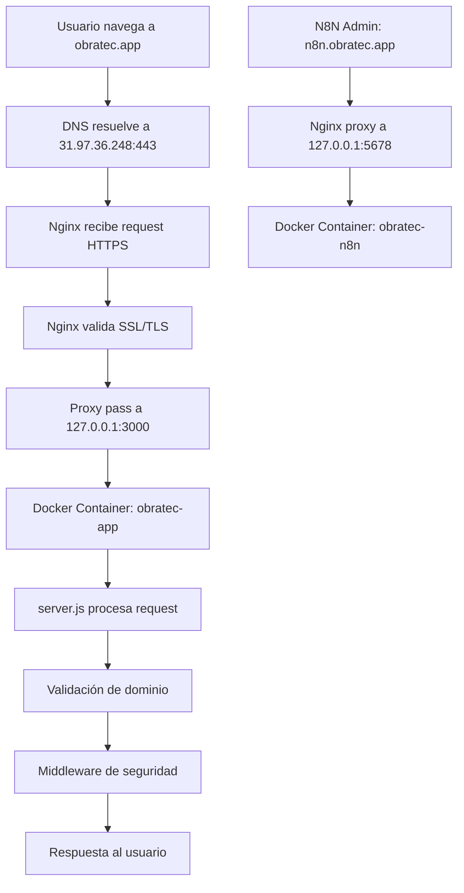

# Estado de Nginx y Server.js en VPS - obratec.app

**Fecha de actualización:** 19 de agosto de 2025  
**VPS:** srv844163 (31.97.36.248)  
**Dominio:** obratec.app  

---

## 🌐 Estado General del Sistema

### ✅ Servicios Activos
- **Nginx**: Activo y funcionando como proxy reverso
- **Docker**: 3 contenedores corriendo
- **SSL**: Certificados Let's Encrypt configurados
- **Aplicación**: Obratec disponible en producción

---

## 🔧 Configuración de Nginx

### 📍 Rutas del Sistema VPS
```bash
# Configuración principal
/etc/nginx/sites-available/obratec.app          # Configuración principal
/etc/nginx/sites-enabled/obratec.app            # Enlace simbólico activo
/etc/nginx/nginx.conf                           # Configuración global

# Certificados SSL
/etc/letsencrypt/live/obratec.app/fullchain.pem # Certificado público
/etc/letsencrypt/live/obratec.app/privkey.pem   # Clave privada

# Logs del sistema
/var/log/nginx/obratec.access.log               # Logs de acceso principal
/var/log/nginx/obratec.error.log                # Logs de errores principal
/var/log/nginx/n8n.obratec.access.log           # Logs de acceso N8N
/var/log/nginx/n8n.obratec.error.log            # Logs de errores N8N

# Backups (automáticos)
/etc/nginx/sites-available/obratec.app.backup.* # Backups de configuraciones
```

### 🚪 Configuración de Puertos
| Puerto | Servicio | Protocolo | Descripción |
|--------|----------|-----------|-------------|
| **80** | Nginx | HTTP | Redirige automáticamente a HTTPS |
| **443** | Nginx | HTTPS | Proxy reverso principal con SSL |
| **3000** | Docker App | HTTP | Aplicación obratec (interno) |
| **5678** | Docker N8N | HTTP | N8N workflow (solo localhost) |

### 🎯 Dominios y Redirecciones

#### Dominio Principal: `obratec.app`
- **HTTP → HTTPS**: Redirección automática 301
- **HTTPS**: Proxy reverso a `127.0.0.1:3000` (aplicación principal)
- **Headers de seguridad**: HSTS, XSS Protection, Content Security
- **Límite de subida**: 50MB (para archivos de audio)

#### Subdominio N8N: `n8n.obratec.app`
- **HTTP → HTTPS**: Redirección automática 301
- **HTTPS**: Proxy reverso a `127.0.0.1:5678` (panel de administración N8N)
- **Headers específicos**: X-Forwarded-Host, X-Forwarded-Server

### 📋 Características Especiales
```nginx
# Optimización de archivos estáticos
location ~* \.(js|css|png|jpg|jpeg|gif|ico|svg|woff|woff2|ttf|eot)$ {
    expires 1y;
    add_header Cache-Control "public, immutable";
}

# Health check endpoint
location /health {
    proxy_pass http://127.0.0.1:3000/health;
}

# Timeouts optimizados
proxy_read_timeout 300s;
proxy_connect_timeout 75s;
```

---

## 🐳 Estado de Docker

### 📦 Contenedores Activos
```bash
# Comando para verificar: docker ps
CONTAINER ID   IMAGE                   PORTS                       NAMES
3c3bd2d746cb   informe_obra_app        0.0.0.0:3000->3000/tcp     obratec-app
eb8c0b180e44   n8nio/n8n:latest        127.0.0.1:5678->5678/tcp   obratec-n8n
2f57e73fa8f3   gotenberg/gotenberg:8   3000/tcp                    obratec-gotenberg
```

### 🔄 Funciones de cada contenedor:
1. **obratec-app**: Aplicación principal Node.js con server.js
2. **obratec-n8n**: Motor de workflows y automatización
3. **obratec-gotenberg**: Generador de PDFs (uso interno)

---

## 📜 Archivo server.js - Funcionalidad

### 📍 Ubicación en VPS
```bash
# Dentro del contenedor obratec-app
/app/server.js                                  # Archivo principal del servidor
```

### 🎯 Propósito y Funcionalidades

#### 1. **Servidor Express Principal**
```javascript
const PORT = process.env.PORT || 3000;
// Maneja todas las rutas de la aplicación web
```

#### 2. **Middleware de Seguridad**
- **Helmet**: Headers de seguridad HTTP
- **CORS**: Control de acceso entre dominios
- **Compression**: Compresión gzip de respuestas
- **Rate limiting**: Límites de requests por IP

#### 3. **Verificación de Dominios**
```javascript
const allowedDomains = [
    'obratec.app',
    'www.obratec.app', 
    'n8n.obratec.app',
    'localhost',
    '127.0.0.1',
    '31.97.36.248',
    'mcp-server'
];
```
**Función**: Bloquea accesos desde dominios no autorizados para evitar ataques.

#### 4. **Proxy Middleware**
- **Rutas /webhook/**: Redirige a N8N para procesamiento de formularios
- **Rutas /api/**: Maneja APIs internas
- **Archivos estáticos**: Sirve CSS, JS, imágenes desde `/public`

#### 5. **Manejo de Archivos**
- **Límite de subida**: 50MB para archivos de audio
- **Tipos soportados**: MP3, WAV, OGG, M4A, AAC, FLAC
- **Conversión HEIC**: Convierte imágenes de iPhone a formatos web

#### 6. **Health Check**
```javascript
// Endpoint /health para monitoreo
app.get('/health', (req, res) => {
    res.status(200).json({ 
        status: 'OK', 
        timestamp: new Date().toISOString() 
    });
});
```

---

## 🔍 Comandos de Monitoreo

### Verificar Estado del Sistema
```bash
# Estado de nginx
systemctl status nginx

# Estado de contenedores
docker ps

# Logs en tiempo real
tail -f /var/log/nginx/obratec.access.log
docker logs -f obratec-app

# Verificar puertos
netstat -tlnp | grep -E ":(80|443|3000|5678)"

# Test de conectividad interna
curl -I http://127.0.0.1:3000
curl -I http://127.0.0.1:5678
```

### Reiniciar Servicios
```bash
# Recargar nginx (sin downtime)
systemctl reload nginx

# Reiniciar contenedores
docker-compose -f docker-compose.vps.yml restart

# Ver logs de errores
tail -f /var/log/nginx/obratec.error.log
```

---

## 🏁 Flujo de Request Completo


```mermaid
graph TD
    A[Usuario navega a obratec.app] --> B[DNS resuelve a 31.97.36.248:443]
    B --> C[Nginx recibe request HTTPS]
    C --> D[Nginx valida SSL/TLS]
    D --> E[Proxy pass a 127.0.0.1:3000]
    E --> F[Docker Container: obratec-app]
    F --> G[server.js procesa request]
    G --> H[Validación de dominio]
    H --> I[Middleware de seguridad]
    I --> J[Respuesta al usuario]
    
    K[N8N Admin: n8n.obratec.app] --> L[Nginx proxy a 127.0.0.1:5678]
    L --> M[Docker Container: obratec-n8n]
```

---

## 🛡️ Configuración de Seguridad

### Headers de Seguridad Activos
- **HSTS**: Fuerza HTTPS por 1 año
- **X-Frame-Options**: DENY (previene clickjacking)
- **X-Content-Type-Options**: nosniff
- **X-XSS-Protection**: Activa protección XSS

### Restricciones de Acceso
- **N8N**: Solo accesible vía subdominio específico
- **Docker interno**: Puertos no expuestos externamente
- **Dominios**: Lista blanca en server.js

---

## 📈 Métricas de Performance

### Timeouts Configurados
- **Proxy read timeout**: 300 segundos
- **Proxy connect timeout**: 75 segundos
- **Client body timeout**: Estándar nginx

### Optimizaciones
- **Caché de archivos estáticos**: 1 año
- **Compresión gzip**: Activa
- **HTTP/2**: Habilitado en HTTPS

---

## 🔧 Mantenimiento Recomendado

### Diario
- Revisar logs de error: `tail /var/log/nginx/obratec.error.log`
- Verificar estado de contenedores: `docker ps`

### Semanal  
- Verificar espacio en disco: `df -h`
- Revisar logs de acceso para patrones anómalos

### Mensual
- Renovación automática SSL (Let's Encrypt)
- Limpieza de logs antiguos
- Backup de configuraciones

---

**Estado del sistema: ✅ OPERATIVO**  
**Último deployment exitoso:** 19 de agosto de 2025, 16:43 UTC  
**Próxima revisión programada:** 19 de septiembre de 2025
